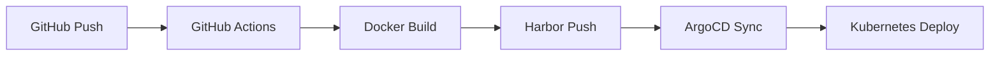

# 🚀 JCode Frontend - 교육용 웹IDE 플랫폼

<div align="center">


**현대적이고 확장 가능한 교육용 웹IDE 플랫폼**

[데모 보기](#-주요-기능) • [설치 가이드](#-설치-및-실행) • [배포 가이드](#-배포)

</div>

---

## 📋 프로젝트 개요

JCode Frontend는 React 기반의 모던한 교육용 웹IDE 플랫폼입니다. 실시간 코드 편집, 시스템 모니터링, 사용자 관리 등의 기능을 제공하여 온라인 프로그래밍 교육 환경을 지원합니다.

### ✨ 주요 특징
- 🎨 **Material-UI 기반의 세련된 UI/UX**
- 📊 **Chart.js를 활용한 데이터 시각화**
- 🔧 **웹 기반 통합 개발 환경**
- 📈 **실시간 시스템 모니터링**
- 👥 **사용자 및 관리자 대시보드**
- 🚢 **컨테이너 기반 배포 지원**
- ☸️ **Kubernetes & ArgoCD를 통한 자동화된 CI/CD**

---

## 🛠️ 기술 스택

### Frontend Core
- **React 18** - 모던한 UI 라이브러리
- **React Router DOM 7** - 클라이언트 사이드 라우팅
- **Material-UI 6** - 구글 디자인 시스템 기반 컴포넌트

### 데이터 시각화
- **Chart.js 4** - 차트 및 그래프 렌더링
- **Plotly.js** - 고급 데이터 시각화
- **Framer Motion** - 부드러운 애니메이션

### 상태 관리 & 네트워킹
- **Axios** - HTTP 클라이언트
- **JWT Decode** - 토큰 기반 인증
- **React Context** - 전역 상태 관리

### DevOps & 배포
- **Docker** - 컨테이너화
- **Kubernetes** - 오케스트레이션
- **ArgoCD** - GitOps 기반 CD
- **Harbor Registry** - 컨테이너 이미지 저장소

---

## 🏗️ 프로젝트 구조

```
frontend/
├── 📁 src/
│   ├── 📁 components/     # 재사용 가능한 UI 컴포넌트
│   ├── 📁 pages/          # 라우트별 페이지 컴포넌트
│   │   ├── 📁 webide/     # 웹IDE 관련 페이지
│   │   ├── 📁 watcher/    # 모니터링 대시보드
│   │   ├── 📁 admin/      # 관리자 페이지
│   │   ├── 📁 auth/       # 인증 관련 페이지
│   │   └── 📁 about/      # 정보 페이지
│   ├── 📁 contexts/       # React Context providers
│   ├── 📁 hooks/          # 커스텀 React hooks
│   ├── 📁 api/            # API 통신 로직
│   ├── 📁 utils/          # 유틸리티 함수
│   └── 📁 styles/         # 스타일 파일
├── 📁 k8s/               # Kubernetes 매니페스트
├── 📁 nginx/             # Nginx 설정
└── 📄 Dockerfile         # 컨테이너 이미지 빌드
```

---

## 🚀 설치 및 실행

### 사전 요구사항
- Node.js 16.0 이상
- npm 또는 yarn

### 로컬 개발 환경 설정

```bash
# 저장소 클론
git clone <repository-url>
cd frontend

# 의존성 설치
npm install

# 개발 서버 실행
npm start
```

애플리케이션이 [http://localhost:3000](http://localhost:3000)에서 실행됩니다.

### 사용 가능한 스크립트

| 명령어 | 설명 |
|--------|------|
| `npm start` | 개발 모드로 애플리케이션 실행 |
| `npm test` | 테스트 러너 실행 |
| `npm run build` | 프로덕션 빌드 생성 |
| `npm run eject` | CRA 설정 추출 (비권장) |

---

## 🐳 Docker 배포

### 개발 환경
```bash
# 개발용 이미지 빌드
docker build -f Dockerfile.dev -t jcode-frontend:dev .

# 컨테이너 실행
docker run -p 3000:3000 jcode-frontend:dev
```

### 프로덕션 환경
```bash
# 프로덕션 이미지 빌드
docker build -t jcode-frontend:latest .

# 컨테이너 실행
docker run -p 80:80 jcode-frontend:latest
```

---

## ☸️ Kubernetes 배포

### ArgoCD를 통한 GitOps 배포

#### 1. Harbor Registry 인증 설정
```bash
kubectl create secret docker-registry harbor-registry-secret \
  --namespace=watcher \
  --docker-server=harbor.jbnu.ac.kr \
  --docker-username=<HARBOR_USERNAME> \
  --docker-password=<HARBOR_PASSWORD>
```

#### 2. ArgoCD 애플리케이션 배포
```bash
kubectl apply -f k8s/argocd-application.yaml
```

#### 3. 배포 확인
- ArgoCD UI에서 배포 상태 모니터링
- 자동 동기화를 통한 지속적 배포

### 배포 자동화 워크플로우



---

## 📊 주요 기능

### 🖥️ 웹IDE
- 실시간 코드 편집기
- 다양한 프로그래밍 언어 지원
- 인라인 오류 검사 및 자동 완성

### 📈 모니터링 대시보드
- 실시간 시스템 메트릭
- 상호작용 가능한 차트
- 사용자 활동 추적

### 👤 사용자 관리
- JWT 기반 인증
- 역할 기반 접근 제어
- 사용자 프로필 관리

### 🎨 현대적 UI/UX
- 반응형 디자인
- 다크/라이트 테마 지원
- 부드러운 애니메이션

---

## 🤝 기여하기

1. Fork the repository
2. Create your feature branch (`git checkout -b feature/AmazingFeature`)
3. Commit your changes (`git commit -m 'Add some AmazingFeature'`)
4. Push to the branch (`git push origin feature/AmazingFeature`)
5. Open a Pull Request

---

## 📄 라이센스

이 프로젝트는 MIT 라이센스 하에 배포됩니다. 자세한 내용은 `LICENSE` 파일을 참조하세요.

---

## 📞 연락처

프로젝트에 대한 문의사항이나 제안이 있으시면 언제든 연락해 주세요!

---

<div align="center">

**⭐ 이 프로젝트가 유용하다면 별점을 눌러주세요! ⭐**

Made by [sh]

</div>
