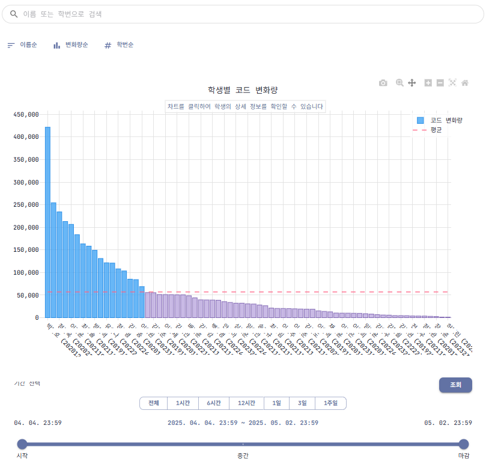

# JCode Frontend - 교육용 웹IDE 플랫폼

[](https://opensource.org/licenses/MIT)


> 🎓 **현대적인 교육용 웹 통합 개발 환경**  
> React와 Material-UI로 구축된 오픈소스 교육 플랫폼

** 라이브 데모**: [https://jcode.jbnu.ac.kr](https://jcode.jbnu.ac.kr/about) | **📚 문서**: [사용자 가이드](https://jhelper.jbnu.ac.kr/JCode)

## 프로젝트 소개

**JCode Frontend**는 교육 기관을 위한 현대적인 웹 기반 통합 개발 환경입니다. 학생들의 코딩 학습을 지원하고 교육자들이 학습 과정을 모니터링할 수 있는 종합적인 플랫폼을 제공합니다.

### 주요 목표
- **접근성**: 웹 브라우저만으로 언제 어디서나 동일한 개발 환경 제공
- **교육 중심**: 학습 과정 추적 및 분석 기능으로 효과적인 교육 지원  
- **확장성**: 마이크로서비스 아키텍처로 다양한 교육 환경에 적용 가능
- **오픈소스**: MIT 라이선스로 자유로운 사용 및 기여 환경

> 💡 **실제 검증**: 전북대학교에서 운영 중인 **JEduTools** 플랫폼의 일부로 실제 교육 현장에서 검증된 솔루션입니다.

## 주요 기능

### WebIDE - "언제 어디서나 똑같은 나만의 개발 환경"
- **VSCode 기반**: 웹 브라우저에서 VSCode와 동일한 개발 환경
- **다중 언어 지원**: Python, C/C++ 등 주요 프로그래밍 언어
- **실시간 자동 저장**: 공용 PC 환경에서도 안전한 작업 환경
- **컨테이너 격리**: 사용자별 완전히 독립된 개발 환경

### Watcher - "학습 과정을 한눈에"  
- **실시간 모니터링**: 코딩 활동, 컴파일, 실행 과정 실시간 추적
- **학습 분석**: 시간별 작업 패턴 및 학습 진도 시각화
- **통계 대시보드**: Plotly.js 기반 인터랙티브 차트

### 사용자 경험
- **반응형 디자인**: 모바일부터 데스크톱까지 최적화된 UI
- **다크/라이트 모드**: 사용자 선호에 따른 테마 지원
- **직관적 인터페이스**: Material-UI 기반 일관성 있는 디자인
- **접근성 지원**: 웹 표준을 준수한 접근 가능한 인터페이스

---

## 서비스 화면

### WebIDE 개발 환경
<!-- WebIDE 스크린샷 이미지를 여기에 추가 -->

*VSCode 기반 웹 통합 개발 환경*

### Watcher 모니터링 대시보드
<!-- Watcher 대시보드 스크린샷 이미지를 여기에 추가 -->

*실시간 코딩 활동 모니터링 및 분석 대시보드*

### 데이터 시각화
<!-- Plotly.js 차트 스크린샷 이미지를 여기에 추가 -->


*Plotly.js를 활용한 인터랙티브 데이터 시각화*

---

## 운영 환경

- **Production URL**: [https://jcode.jbnu.ac.kr](https://jcode.jbnu.ac.kr/about)
- **Infrastructure**: 전북대학교 JCloud (교내 클라우드 플랫폼)
- **Parent Project**: JEduTools 교육 도구 통합 플랫폼
- **Authentication**: JEduTools 통합 로그인 시스템 연동
- **Documentation**: [JCode 사용 메뉴얼](https://jhelper.jbnu.ac.kr/JCode)


## 🛠 빠른 시작

### 필요 조건
- **Node.js** 18.0 이상
- **npm** 8.0 이상  
- **Docker** (선택사항)

### 로컬 개발 환경

```bash
# 1. 레포지토리 클론
git clone https://github.com/JBNU-JEduTools/JCode-Frontend.git

# 2. 의존성 설치
npm install

# 3. 환경 변수 설정
cp .env.example .env
# .env 파일을 편집하여 백엔드 API URL 등을 설정

# 4. 개발 서버 실행
npm start
```

브라우저에서 http://localhost:3000 으로 접속하여 확인하세요.

### Docker로 실행

```bash
# 프로덕션용 이미지 빌드
docker build -t jcode-frontend:latest .

# 컨테이너 실행
docker run -p 80:80 jcode-frontend:latest
```

### 환경 변수 설정

`.env.example` 파일을 참고하여 다음 환경 변수를 설정하세요:

```bash
# 백엔드 API 서버 URL
REACT_APP_API_URL=http://localhost:8080

# OAuth2 설정 (선택사항)
REACT_APP_KEYCLOAK_URL=http://localhost:8080/auth
REACT_APP_CLIENT_ID=your-client-id
REACT_APP_SCOPE=openid
REACT_APP_REDIRECT_URI=http://localhost:3000/auth/callback
REACT_APP_REALM=your-realm
```

---

## 기여하기

JCode Frontend는 오픈소스 프로젝트로, 여러분의 기여를 환영합니다!

### 기여 방법

1. **이슈 확인**: 이슈 발견
2. **포크 & 클론**: 레포지토리를 포크하고 로컬에 클론하세요
3. **브랜치 생성**: `git checkout -b feature/your-feature-name`
4. **개발 & 테스트**: 변경사항을 구현하고 테스트하세요
5. **Pull Request**: 변경사항을 설명하는 PR을 생성하세요

자세한 기여 가이드라인은 [CONTRIBUTING.md](./CONTRIBUTING.md)를 참고하세요.

### Good First Issues

처음 기여하시는 분들을 위한 이슈들:
- **버그 수정**: 사소한 UI 버그나 타이포 수정
- **문서화**: 주석 추가, README 개선
- **국제화**: 다국어 지원 추가
- **UI/UX**: 접근성 개선, 반응형 디자인 개선

---

## 프로젝트 아키텍처

### 폴더 구조
```
frontend/
├── public/                  # 정적 파일
│   ├── index.html           # 메인 HTML 템플릿
│   └── manifest.json        # PWA 매니페스트
├── src/
│   ├── components/          # 재사용 가능한 UI 컴포넌트
│   │   ├── common/          # 공통 컴포넌트 (Breadcrumbs 등)
│   │   ├── layout/          # 레이아웃 (Header, Footer, Sidebar)
│   │   └── ui/              # 기본 UI (Button, LoadingSpinner 등)
│   ├── features/            # 기능별 모듈 (도메인 중심 설계)
│   │   ├── about/           # 소개 페이지
│   │   ├── admin/           # 관리자 기능
│   │   ├── auth/            # 인증 시스템
│   │   ├── profile/         # 사용자 프로필
│   │   ├── watcher/         # 모니터링 대시보드
│   │   └── webide/          # 웹IDE 인터페이스
│   ├── pages/               # 라우트별 페이지 컴포넌트
│   ├── services/            # API 서비스 레이어
│   │   └── api/             # RESTful API 클라이언트
│   ├── contexts/            # React Context Providers
│   ├── hooks/               # 커스텀 Hooks
│   ├── utils/               # 유틸리티 함수
│   ├── constants/           # 상수 정의
│   ├── styles/              # 글로벌 스타일
│   └── assets/              # 이미지, 아이콘 등
├── nginx/                   # Nginx 설정 파일
├── k8s/                     # Kubernetes 매니페스트
├── .github/                 # GitHub 템플릿 및 워크플로우
└── docs/                    # 프로젝트 문서
```

### 기술 스택 & 아키텍처 패턴

#### **Frontend Core**
- **React 18.2.0**: Concurrent Features, Suspense, Error Boundaries
- **Material-UI 6.4.7**: Design System + Custom Theme
- **React Router 7**: Client-side Routing + Code Splitting
- **Plotly.js 3.0.1**: Scientific Visualization Library

```

- **Context API**: 글로벌 상태 (인증, 테마)
- **Local State**: 컴포넌트별 UI 상태
- **Custom Hooks**: 비즈니스 로직 재사용
- **Memo/Callback**: 성능 최적화

---

## 성능 최적화

- **메모이제이션**: React.memo, useMemo, useCallback 최적화
- **번들 최적화**: Webpack 청크 분할
- **이미지 최적화**: WebP 지원, lazy loading
- **캐싱 전략**: API 응답 캐싱, 브라우저 캐시 활용

---

## 로드맵

### v1.3.0 (계획 중)
- [ ] 코드 통계 - 컴파일, 빌드 학생 간 비교 기능 추가

### v1.4.0 (장기 계획)
- [ ] 코드 통계 - 과제에 대한 과거 기록 분석 및 ai 분석 추가가

---

## 라이선스

이 프로젝트는 [MIT License](./LICENSE) 하에 배포됩니다.

```
MIT License

Copyright (c) 2024 JCode Frontend Contributors

Permission is hereby granted, free of charge, to any person obtaining a copy
of this software and associated documentation files (the "Software"), to deal
in the Software without restriction, including without limitation the rights
to use, copy, modify, merge, publish, distribute, sublicense, and/or sell
copies of the Software, and to permit persons to whom the Software is
furnished to do so, subject to the following conditions:

The above copyright notice and this permission notice shall be included in all
copies or substantial portions of the Software.

THE SOFTWARE IS PROVIDED "AS IS", WITHOUT WARRANTY OF ANY KIND, EXPRESS OR
IMPLIED, INCLUDING BUT NOT LIMITED TO THE WARRANTIES OF MERCHANTABILITY,
FITNESS FOR A PARTICULAR PURPOSE AND NONINFRINGEMENT. IN NO EVENT SHALL THE
AUTHORS OR COPYRIGHT HOLDERS BE LIABLE FOR ANY CLAIM, DAMAGES OR OTHER
LIABILITY, WHETHER IN AN ACTION OF CONTRACT, TORT OR OTHERWISE, ARISING FROM,
OUT OF OR IN CONNECTION WITH THE SOFTWARE OR THE USE OR OTHER DEALINGS IN THE
SOFTWARE.
```

---

## 지원 및 커뮤니티

### 질문하기
- 이메일: [jedutools@gmail.com](mailto:jedutools@gmail.com)

### 관련 프로젝트
- [JCode Backend](https://github.com/JBNU-JEduTools/JCode-Backend) - 백엔드 API 서버
- [JCode Watcher](https://github.com/JBNU-JEduTools/JCode-Watcher) - 데이터 수집 및 가공공

---


** 이 프로젝트가 도움이 되셨다면 스타를 눌러주세요! ⭐**

Made with ❤️ by the JCode Community


